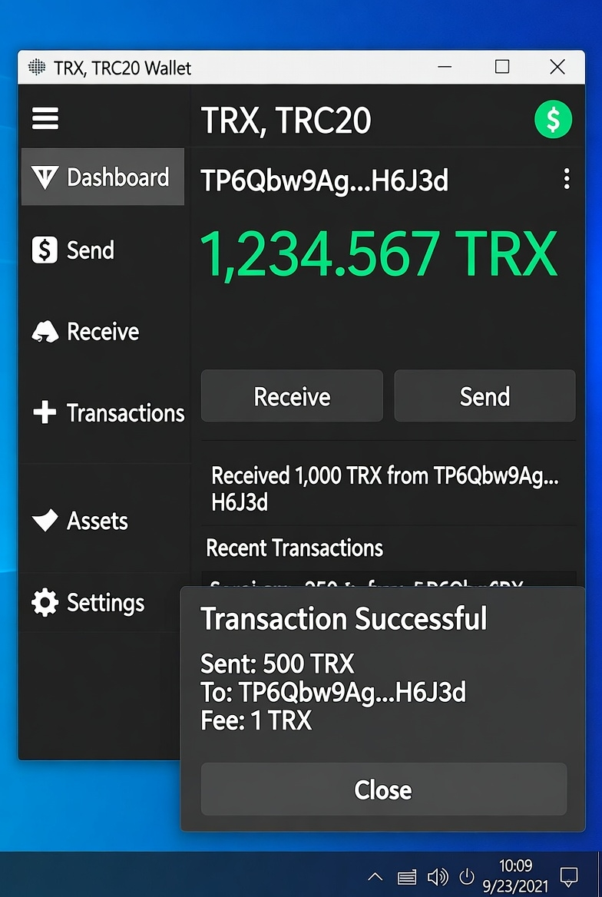

# Инструмент для перевода USDT TRC20


Мощное и многофункциональное .NET приложение для работы с токенами USDT в блокчейне TRON. Этот инструмент упрощает процесс перевода токенов USDT, проверки балансов и выполнения различных операций с TRON адресами.



## 🚀 Возможности

- **Переводы USDT в сети TRON**
  - Поддержка переводов в MainNet
  - Поддержка переводов в TestNet (Shasta)
  - Умный выбор сети

- **Операции с кошельком**
  - Валидация TRC20 адресов из приватных ключей
  - Проверка баланса TRX
  - Проверка баланса USDT
  - Комплексная проверка адресов

- **Функции безопасности**
  - Скрытие приватного ключа при вводе
  - Локальная подпись транзакций
  - Ключи не сохраняются на диске

- **Тестовые утилиты**
  - Инструменты тестирования подписей
  - Инструменты проверки адресов
  - Набор тестов для конвертации Base58
  - Валидация символов Base58

- **Обработка ошибок**
  - Предварительная проверка баланса перед переводами
  - Комплексная система отчетов об ошибках
  - Верификация транзакций


## 📋 Предварительные требования

- [.NET 9.0 SDK](https://dotnet.microsoft.com/download/dotnet/9.0) или новее
- Доступ в интернет (для связи с API блокчейна)
- Базовое понимание операций с TRON и USDT

## ⚙️ Установка

1. Клонируйте репозиторий:
```bash
git clone https://github.com/yourusername/USDT-TRC20Transfer.git

    Перейдите в директорию проекта:

bash

cd USDT-TRC20Transfer

    Соберите проект:

bash

dotnet build

    Запустите приложение:

bash

dotnet run

⚙️ Конфигурация

Приложение использует appsettings.json для конфигурации. Пример файла конфигурации:
json

{
  "ApiEndpoints": {
    "TronGrid": {
      "Mainnet": "https://api.trongrid.io",
      "Testnet": "https://api.shasta.trongrid.io"
    }
  },
  "ExplorerUrls": {
    "Mainnet": "https://tronscan.org/#/transaction/",
    "Testnet": "https://shasta.tronscan.org/#/transaction/"
  },
  "Contracts": {
    "USDT": "TR7NHqjeKQxGTCi8q8ZY4pL8otSzgjLj6t"
  },
  "DefaultWallet": "Your_Default_Wallet_Address",
  "TransferSettings": {
    "MinTransferAmountSun": "1",
    "MaxTransferAmountSun": "1000000000000",
    "QuickCheckAttempts": "3",
    "QuickCheckWaitMs": "5000",
    "SunToTrx": "1000000"
  }
}

💻 Использование
📋 Главное меню

При запуске приложения вы увидите меню:
text

🔧 Меню операций TRON (TRX/TRC20) 🔧
===================================
1 - Проверка TRC20 адреса из приватного ключа
2 - Проверка баланса TRX
3 - Проверка баланса USDT (TRC20)
4 - Реальный перевод USDT (TRC20) (MainNet)
5 - Тестовый перевод USDT (TRC20) (TestNet)
6 - Перевод USDT (TRC20) с выбором сети
7 - Запуск тестовых функций
8 - Тест конвертации TRON адресов (Комплексный)
9 - Настройки и информация
0 - Выход
===================================

💰 Проверка балансов

Для проверки баланса TRX или USDT:

    Выберите опцию 2 или 3 в главном меню

    Введите адрес кошелька или оставьте пустым для использования адреса по умолчанию

    Просмотрите информацию о балансе

Пример вывода:
text

💰 Баланс USDT (TRC20): 1,234.56 USDT
   Использованный адрес: TWiWt5SEDzaEqS6kE5gandWMNfxR2B5xzg

🔄 Выполнение перевода

Для перевода токенов USDT:

    Выберите опцию 4, 5 или 6 в зависимости от предпочтений по сети

    Введите ваш приватный ключ (не беспокойтесь, он скрыт!)

    Введите адрес получателя

    Укажите сумму для перевода

    Подтвердите детали транзакции

    Просмотрите результат транзакции

Пример процесса:
text

🔗 Перевод USDT (TRC20) - MAINNET
----------------------------------
Приватный ключ отправителя: ********
Адрес получателя: TRzJDfBTkbXLinWAMgMpabXJi6kP6vQPTt
Сумма перевода (USDT): 50

📋 Детали перевода:
Отправитель: TWiWt5SEDzaEqS6kE5gandWMNfxR2B5xzg
Получатель: TRzJDfBTkbXLinWAMgMpabXJi6kP6vQPTt
Сумма: 50.00 USDT
Сеть: MAINNET

Подтвердить? (Y/N): Y

✅ Перевод успешно выполнен!
ID транзакции (TxID): 4a0db35c734cb8c4ea63f47fd13104af02c8ea1051a0e4772bffc131f631c944
Детали транзакции: https://tronscan.org/#/transaction/4a0db35c734cb8c4ea63f47fd13104af02c8ea1051a0e4772bffc131f631c944

🧪 Тестовые функции

Для разработчиков и устранения неполадок доступны различные тестовые функции:

    Выберите опцию 7 в главном меню

    Выберите из различных тестовых опций, таких как тестирование подписей, проверка адресов и т.д.

⚠️ Предупреждения безопасности

    НИКОГДА не передавайте ваш приватный ключ кому-либо

    Всегда дважды проверяйте адреса получателей перед подтверждением переводов

    Используйте TestNet для экспериментов перед использования реальных средств в MainNet

    Рассмотрите возможность запуска этого инструмента только на защищенных личных компьютерах

    Инструмент не сохраняет ваши приватные ключи, но будьте осторожны с кейлоггерами или вредоносными программами для захвата экрана

🔧 Частые проблемы и решения
Проблема	Решение
"SIGERROR" при переводе	Проверьте, что приватный ключ соответствует адресу отправителя
"Неверный символ base58"	Проверьте на наличие confusing символов (0/O, l/1/I)
Ошибка проверки баланса	Убедитесь в наличии подключения к интернету и доступа к API
Предупреждение о низком балансе TRX	Убедитесь, что у вас есть как минимум 5 TRX для комиссий
Транзакция в ожидании	Дождитесь подтверждения в блокчейне (обычно 1-3 минуты)
🛠️ Продвинутые функции
Валидация символов Base58

Этот инструмент включает специальную валидацию для символов Base58 для предотвращения распространенных ошибок, таких как путаница между:

    Цифрой 0 и буквой O

    Буквой l и цифрой 1

    Буквой I и цифрой 1

Подпись транзакций

Транзакции подписываются локально перед отправкой в сеть, что гарантирует, что ваши приватные ключи никогда не покидают ваш компьютер. Процесс подписания следует этим шагам:

    Создание параметров транзакции (отправитель, получатель, сумма)

    Получение сырой транзакции из TRON API

    Хеширование данных транзакции с помощью SHA-256

    Подпись хеша приватным ключом (используя Nethereum.Signer)

    Проверка соответствия подписи адресу отправителя

    Отправка подписанной транзакции в сеть

    Проверка статуса транзакции

🔄 Процесс транзакции
text

┌─────────────┐       ┌─────────────┐        ┌─────────────────┐
│ Ввод данных │──────▶│Проверка баланса│──────▶│Создание транзакции│
└─────────────┘       └─────────────┘        └────────┬────────┘
                                                      │
                                                      │
┌─────────────┐       ┌─────────────┐        ┌────────▼────────┐
│ Результат   │◀──────│Проверка статуса│◀─────│Подпись и отправка│
└─────────────┘       └─────────────┘        └─────────────────┘

🤝 Участие в разработке

Вклад приветствуется! Вы можете:

    Сделать форк репозитория

    Создать ветку для функции (git checkout -b feature/amazing-feature)

    Зафиксировать изменения (git commit -m 'Add some amazing feature')

    Отправить в ветку (git push origin feature/amazing-feature)

    Открыть Pull Request

📄 Лицензия

Этот проект лицензирован под MIT License - подробности в файле LICENSE.
📞 Контакты

Есть вопросы? Нашли ошибку? Хотите поучаствовать в разработке? Создайте issue в этом репозитории.

Помните: С большой крипто-силой приходит большая крипто-ответственность!

Этот инструмент предоставляется "как есть" без каких-либо гарантий. Всегда дважды проверяйте переводы и используйте на свой страх и риск.
